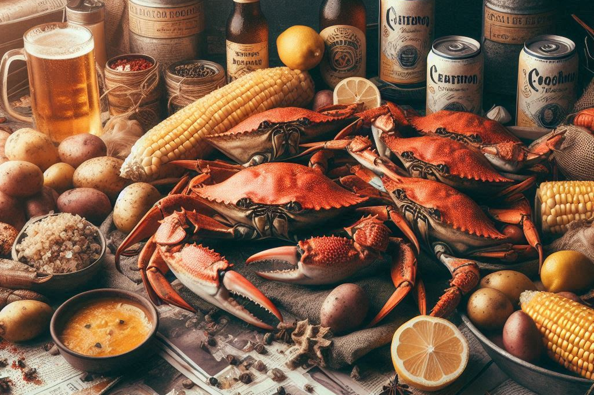

# The King Crab Hack (KCH 2.0)
## An Updated Model


 
## Background
 
Since the release of the orginal [KCH problem](https://github.com/xweih/kcs), the menus of the restaurant has changed to some degree. Consequently, it affected the utility of my previous model. So in this post, I outline the menu change, and the subsequent model updates. 
 
## Menu Changes
 
Other than the price increase, the old menus, including Build Your Own Seafood Bag and Seafood Combos, remain the same. However, new order options have been added as follows. 

1. The option to order crabs (snow crab, king crab, and dungenese crab) by the half-pound. Previously, one can only order these items by the whole-pound.

| Build Your Own Seafood Bag  | Unit Price | 
| :------  | ---: | 
| king crab (1/2 lb)   |	30.99|
| snow crab (1/2 lb)    |	19.99|
| dungeness crab (1/2 lb)|19.99|

2. Additional single items: egg and broccoli.

3. For the ordering option "Build Your Own Seafood Bag", each bag will receive up to 1 corn and 1 potato (2 items in total) for free, if any seafood item is ordered. 


## Model Updates (KCH 2.0)

1. The new model incorperates all menu changes described above.

2. New items are now available in customer orders: eggs, broccoli.

3. The new model will generate alert when an improper order quantity is entered. For example, if a non-integer valued quantity is entered for item "crawfish", the program will stop.   

 

## The Twist

The model presented in this post inherits from the orginal [KCH problem](https://github.com/xweih/kcs), but with a "twist" in the following sense. 

 1. An additional component in the objective function, i.e., the total cost of a customer-order. I apply a discount equivalent to the price of one corn and one potato ($1.30), contingent upon the inclusion of a "build your own bag" seafood item in the order.
 
 2. Specifically, if a "build your own bag" seafood item exists, then applies such discount. Otherwise, the discount does not apply. 

## The New "Build Your Own Seafood Bag" Price

According to what was delineated in The Twist above, the "Build Your Own Seafood Bag" price with the discount can be computed. This price will be used to benchmark the savings resulted from our final optimal solution. 

```javascript
# The first corn and potato will be free, if there is a seafood order
# Reduced the demand quantity of corn and potato by 1, by using a new df

df_D_modify = D.copy()

if df_D_modify.loc['corn','pound'] >=1 and np.sum(label_seafood * demandLBS) >=1:
    df_D_modify.loc['corn','pound'] = df_D_modify.loc['corn','pound'] - 1
    
if df_D_modify.loc['potato','pound'] >=1 and np.sum(label_seafood * demandLBS) >=1:
    df_D_modify.loc['potato','pound'] = df_D_modify.loc['potato','pound'] - 1

# BYOB Price of the order can be computed immediately
# Variable "demandLBS_disc" is used instead of "demandLBS"

demandLBS_disc = df_D_modify['pound'].to_numpy()
totalByob = np.inner(priceByob, demandLBS_disc)
```

## The Math

In this model, I continue to assume (without prejudice) that ANY given placed order that contains a combo is more economically advantageous than what is solely in "Build Your Own Seafood Bag" style. Hence, the math model is an extension of the famous [knapsack Problem](https://en.wikipedia.org/wiki/Knapsack_problem). 

**Sets:**

$I =$ {crawfish, mussels, shrimp, snow crab, ..., sausage}. $I$ is the set of all items on "build your own bag" menu.

$S =$ $I$ \ {corn, potato, egg, sausage, broccoli}. $S$ is a subset of $I$.

$O =$ {combo 1, combo 2, ... , combo special 2}. $O$ is the set of all combos on the menu.

**Indices:**

$i \in$ {crawfish, mussels, shrimp, snow crab, ..., sausage}: seafood by the pound 

$j \in$ {combo 1, combo 2, ... , combo special 2}: combo


**Decision Variables:**

$X_i \in$ {0,1}: selection of a seafood by the pound, taking the value 1, if seafood $i$ is selected, and 0, if not.  

$Y_j \in$ {0,1}: selection of a combo, taking the value of 1, if combo $j$ is selected, and 0, if not.  

$Z \in$ {0,1}: indicator of a "build your own bag" seafood item, taking the value of 1, if such item exists, and 0, if not.  

**Parameters:**

$C_i$: build-your-own-bag menu price of seafood $i$,  (per pound)

$P_j$: menu price of combo $j$, (per each)

$D_i$: demand quantity (lb) of seafood $i$ as a customer order

$A_{ij}$: the quantity (lb) of seafood $i$ in combo $j$, according to the menu.  


Thus, our mission can be formulated as a **cost-minimization problem** as follows: 


$$ min: \quad \sum_{j \in O} P_j Y_j + \sum_{i \in I} C_i X_i  $$

$$ st:  \quad \sum_{j \in O} A_{ij} Y_j + X_i \geq D_i, \quad \forall i $$

$$ \sum_{i \in S} X_i \geq 2*Z -1 $$

$$X_{corn}  \geq 2*Z -1$$

$$X_{potato} \geq 2*Z -1$$

$$
\begin{align}
   \text{min:} & \sum_{j \in O} P_j Y_j + \sum_{i \in I} C_i X_i &\\
   \text{st:}  & \sum_{j \in O} A_{ij} Y_j + X_i \geq D_i, & \forall i \\
        & \sum_{i \in S} X_i \geq 2 * Z -1 &\\
        & X_{corn}  \geq 2 * Z -1 &\\
        & X_{potato} \geq 2 * Z -1 &\\
\end{align}
$$


## More on the Constraints

To implement the logical condition 2, stated in the section "The Twist" section, I impose the following math conditions. The "Big M" method comes into play here. (Although there is no actual "M" parameter here!)

(a). If no BYOB seafood item is found, then there will be no discount of $1.30 (a free corn and a free potato), i.e., the discount factor, $Z$, is 0. (Same in b and c.)

$$If\ \sum_{i \in S} X_i =0,\ then\ Z=0 \qquad \Longleftrightarrow \qquad \sum_{i \in S} X_i -1 \geq 2*Z -2$$

(b). If no individual corn is found, then there will be no discount.

$$If\ X_{corn} =0,\ then\ Z=0 \qquad \Longleftrightarrow \qquad X_{corn} -1 \geq 2*Z -2$$

(c). If no individual potato is found, then there will be no discount.

$$If\ X_{potato} =0,\ then\ Z=0 \qquad \Longleftrightarrow \qquad X_{potato} -1 \geq 2*Z -2$$

IMPLICATION: The contraints (a), (b), and (c) collectively ensures that the discount is only given when orders of seafood, corn, and potato are ALL met. 


## The Code

The above mathematical model is encoded in Python Jupyter notebook with [CVXPY](https://www.cvxpy.org/) as the solver. Adding the following routine is necessary. 

```javascript
import numpy as np
import pandas as pd
import math
```
Import CVXPY library, assuming CVXPY has been installed properly.

```javascript
import cvxpy as cp
```
 
First, I preprocess the data, i.e., the KCS's menu pricing information and my required order that are contained in a few csv files. 

```javascript
A = pd.read_csv('input/combos_v1.csv')
C = pd.read_csv('input/menu_byob_v1.csv')
P = pd.read_csv('input/menu_combo_v1.csv')
my_order = pd.read_csv('input/cust_order_v1.csv')

# First, check if all the customer orders are legal, i.e., in proper quantity
my_order = my_order.set_index('item')

# These items must be order by the whole pound or by each item
int_items = ['crawfish','mussels','clams','tail','lob_live','scallops','shrimp_wh','shrimp_hs','corn','potato','sausage','egg','broccoli']

# To ensure the order quantities are legal
# Print alert if: the order qty is NOT "nan" AND is NOT an integer
for item in int_items: 
    if np.isfinite(my_order.loc[item,'pound']) and my_order.loc[item, 'pound'] != int(my_order.loc[item, 'pound']):
        print("ATTENTION:",item, "must be ordered by the whole pound; it cannot be", my_order.loc[item,'pound'], 'lbs. Please re-enter.')
        raise SystemExit("Please re-enter the order quantity!")
```

Next, we clean data a little bit. 

```javascript
# Data imputation
A = A.fillna(0)
A = A.set_index('combo')
A.sort_index(inplace=True)
A = A.reindex(sorted(A.columns), axis=1)
C = C.set_index('item')
C.sort_index(inplace=True)
P = P.set_index('combo')
P.sort_index(inplace=True)

# Total numbers of seafood types and combos

num_items = len(C)
num_combos = len(P)

items = C['price'].keys().tolist()
items[items.index('ccm')] = 'crawfish-clams-mussels'
combos = P['price'].keys().tolist()
```

"Customer order" info needs modifying on two places (1)(2)

```javascript
my_order.reset_index(inplace=True)
D = my_order.fillna(0)

# (1) Order quantities of the following should be split into two, due to different unit prices
# (1.1) Split number of "tails" into numbers of "tail_1" and "tail_2"
num_tails = D[D['item'] == 'tail']['pound'].values[0]
num_1_tail = num_tails % 2
num_2_tail = int(num_tails/2)

# (1.2) Split number of "king" into numbers of "king" and "king_half"
num_king = D[D['item'] == 'king']['pound'].values[0]
num_king_one = int(num_king)
num_king_half = math.ceil(num_king - num_king_one)

# (1.3) Split number of "snow" into numbers of "snow" and "snow_half"
num_snow = D[D['item'] == 'snow']['pound'].values[0]
num_snow_one = int(num_snow)
num_snow_half = math.ceil(num_snow - num_snow_one)

# (1.4) Split number of "dung" into numbers of "dun" and "dun_half"
num_dun = D[D['item'] == 'dung']['pound'].values[0]
num_dun_one = int(num_dun)
num_dun_half = math.ceil(num_dun - num_dun_one)

# (2) Crawfish, clams, and mussels have the same price and are interchangable
# Combine these items to form a new item, "ccm"
ccm_lbs = D[D['item'] == 'crawfish']['pound'].values[0] \
        + D[D['item'] == 'clams']['pound'].values[0] \
        + D[D['item'] == 'mussels']['pound'].values[0]

```
Preparing the curated customer demand vector, "D", and "demandLBS", for computation. 

```javascript
# Add "df_add" to the D dataframe and delete "crawfish", "clams", "mussels", and "tail" from it.

dict_add = {'item':['ccm','tail_1','tail_2','king_one','king_half','snow_one','snow_half','dung_one', 'dung_half'], 
            'pound': [ccm_lbs, num_1_tail, num_2_tail, num_king_one, num_king_half, num_snow_one, num_snow_half, num_dun_one, num_dun_half]
           }

df_add = pd.DataFrame(dict_add)

D = pd.concat( [D, df_add], axis=0, ignore_index=True )

D.drop(D[D['item'] == 'crawfish'].index, inplace=True)
D.drop(D[D['item'] == 'clams'].index, inplace=True)
D.drop(D[D['item'] == 'mussels'].index, inplace=True)
D.drop(D[D['item'] == 'tail'].index, inplace=True)
D.drop(D[D['item'] == 'king'].index, inplace=True)
D.drop(D[D['item'] == 'snow'].index, inplace=True)
D.drop(D[D['item'] == 'dung'].index, inplace=True)

# Cast all numeric info into "numpy arrays" for modeling (CVX requirement)
# label_seafood indicates whether an item is a seafood

comboMakeUp = A.values
priceByob = C['price'].to_numpy()
label_seafood = C['seafood'].to_numpy()
priceCombo = P['price'].to_numpy()

D = D.set_index('item')
D.sort_index(inplace=True)
demandLBS = D['pound'].to_numpy()
```

Compute the BYOB price, "totalByob", taking into account of the "free items" upon conditions.

```javascript
# The first corn and potato will be free, if there is a seafood order
# Reduced the demand quantity of corn and potato by 1, by using a new df

df_D_modify = D.copy()

if df_D_modify.loc['corn','pound'] >=1 and np.sum(label_seafood * demandLBS) >=1:
    df_D_modify.loc['corn','pound'] = df_D_modify.loc['corn','pound'] - 1
    
if df_D_modify.loc['potato','pound'] >=1 and np.sum(label_seafood * demandLBS) >=1:
    df_D_modify.loc['potato','pound'] = df_D_modify.loc['potato','pound'] - 1

# BYOB Price of the order can be computed immediately
# Variable "demandLBS_disc" is used instead of "demandLBS"

demandLBS_disc = df_D_modify['pound'].to_numpy()

totalByob = np.inner(priceByob, demandLBS_disc)

```

Finally, we are able to construct a problem in CVXPY

```javascript
# Construct a CVXPY problem with the SCIP backend to solve the MIP

# Define decision variables, x[i]: build your own bag seafood, y[j]: numbers of combos

x = cp.Variable(num_items, integer=True)
y = cp.Variable(num_combos, integer=True)
z = cp.Variable(boolean=True)

# Define objective function

obj_expr = cp.sum(priceCombo @ y) + cp.sum(priceByob @ x) - z * (0.75+0.55)
objective = cp.Minimize(obj_expr)

# Define constraints
M = 1000000

constraints = [ comboMakeUp @ y + x >= demandLBS,
                cp.sum(label_seafood @ x) >= 2 * z - 1 ,
                x[2] >= 2 * z - 1 , #corn
                x[9] >= 2 * z - 1 , #potato
                x >= 0,
                y >= 0
              ]

# Call the solver

prob = cp.Problem(objective, constraints)
prob.solve()
```

Post-process and display the solution to customers. 

```javascript
# Display the solution

print("Status: ", prob.status)
print("The optimal value is:", prob.value)
print("A solution x is")
print(x.value)
print("A solution y is")
print(y.value)
print("A solution z is")
print(z.value)

print( )
print("=============== THE KING CRAB HACK ===============")
print( )
print("Here's everything you ordered: ")
print( )
print(D[D['pound']>0])
print( )
print("'Build Your Own Bag' would have cost: $", round(totalByob,2))
print("\n" "Here's what you should order to get a bang for the buck:" "\n")
for j in range(num_combos):
    if y.value[j] != 0: 
        print(combos[j], " = ", int(y.value[j]))
for i in range(num_items):
    if x.value[i] != 0: 
        print(items[i], " = ", int(x.value[i]))  
if z.value == 1:
    print("Free items: 1 corn and 1 potato")
print( )
print("!! Now, your total (objective value) is: $", round(prob.value,2))
print("!! YOU SAVED: $", round(totalByob - prob.value, 2), "(%s)" % format((totalByob - prob.value) / totalByob, ".0%") )
```

## Example

Let's say, I want to feed a big family (or perhaps just to treat myself). Hence, I need to order the following items:

Crawfish: 1 lb
Mussels: 1 lb
Clams: 1 lb
Shrimp (whole): 2 lbs
Snow Crab: 1.5 lbs
Corn: 3
Potato: 2
Sausage: 1
Eggs: 2
Broccoli: 1

Apparently, I can simply put everything together by the "Build Your Own Seafood Bag" price, with the help of a spread sheet, I can come up with a total order cost of: $ 151.94. 

But with the program presented here, I can get a better result.  

After running the script, we are able to find at least one optimal solution, as follows.

```javascript
Status:  optimal
The optimal value is: 139.93999999999997
A solution x is
[ 1.  0.  1. -0. -0.  2. -0. -0. -0.  1.  0. -0.  0.  0.  1.  0. -0. -0.]
A solution y is
[ 0.  1.  0. -0. -0.  1.  0. -0. -0. -0. -0. -0. -0. -0. -0.  0.  0. -0.
  0.  0.]
A solution z is
1.0

=============== THE KING CRAB HACK ===============

Here's everything you ordered: 

           pound
item            
broccoli     1.0
ccm          3.0
corn         3.0
egg          2.0
potato       2.0
sausage      1.0
shrimp_hs    2.0
snow_half    1.0
snow_one     1.0

'Build Your Own Bag' would have cost: $ 151.94

Here's what you should order to get a bang for the buck:

combo_1_hs  =  1
combo_4_hs  =  1
broccoli   =  1
corn  =  1
egg  =  2
potato  =  1
snow_half  =  1
Free items: 1 corn and 1 potato

!! Now, your total (objective value) is: $ 139.94
!! YOU SAVED: $ 12.0 (8%)
```

The output above is self-explanatory. Notice, because of the presence of "snow_half" in the optimal solution, the discount indicator, Z, is triggered, allowing for the $1.3 discount on the total cost.  

My optimized total now is $ 139.94. I saved $ 12.00!

## Discussion and Extension

This section discusses the recommended modifications to the model for solving extended scenarios.

1.
The concept of the MIP adopted in this model is based on a crucial premise:

"The combo prices are strictly cheaper than any BYOB prices for ordering."

This premise allows the formulation of our problem as a variant of the famous knapsack problem, benefiting from the advantages and elegance of MIP optimization.

Consider a less "well-designed" menu, where the combo prices are not necessarily cheaper than the corresponding BYOB prices for an order. In this case, the Knapsack-style MIP approach may not capture the optimal solution(s), as the algorithm does not compare the candidate solution to a corresponding BYOB setting. Nonetheless, such a premise can be justified by the design of the current menus, validating the current mathematical model. However, in an extended case with the aforementioned menu, reconsideration of the MIP approach for solving the problem is necessary.

2.
For seafood items, such as lobster tails, that have a variable unit cost based on the ordering quantity, the preprocessing procedure of the routine does not allow for later breaking up of the items into smaller units. Specifically, the preprocessing bins each item into the unit with the lower cost first (e.g., 2 tails), then the unit with the higher cost (e.g., 1 tail). When using the model to solve extended cases, changes may be required in the preprocessing so that the binning of the order quantity can be either flexible or accommodating to the particular unit cost of a given case.


